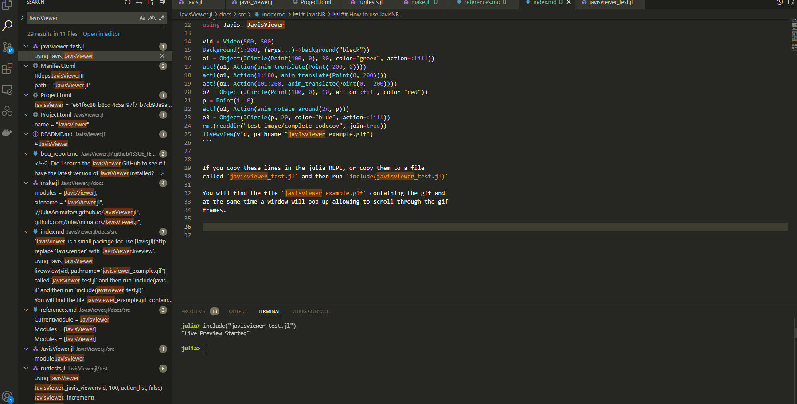

# JavisViewer

## How to use JavisViewer

`JavisViewer` is a small package for use [Javis.jl](https://juliaanimators.github.io/Javis.jl/stable/) with a liveviewer based on `Gtk.jl` and `GtkInteractive.jl`.

It is very straightforward to use.
First write all your code for an animation just like you would with `Javis` and then replace `Javis.render` with `JavisViewer.liveview`.

For example, if you copy these lines in the julia REPL, or copy them to a file called `javisviewer_test.jl` and then run `include(javisviewer_test.jl)` alongside sending the rendered animation to a file, the gif will be shown in a liveviewer.

```julia
using Javis, JavisViewer

vid = Video(500, 500)
Background(1:200, (args...)->background("black"))
o1 = Object(JCircle(Point(100, 0), 30, color="green", action=:fill))
act!(o1, Action(anim_translate(Point(-200, 0))))
act!(o1, Action(1:100, anim_translate(Point(0, 200))))
act!(o1, Action(101:200, anim_translate(Point(0, -200))))
o2 = Object(JCircle(Point(100, 0), 10, action=:fill, color="red"))
p = Point(10, 0)
act!(o2, Action(anim_rotate_around(2π, p)))
o3 = Object(JCircle(p, 20, color="blue", action=:fill))
liveview(vid, pathname="javisviewer_example.gif")
```

You will find the file `javisviewer_example.gif` containing the gif and
at the same time a window will pop-up allowing to scroll through the gif
frames.


